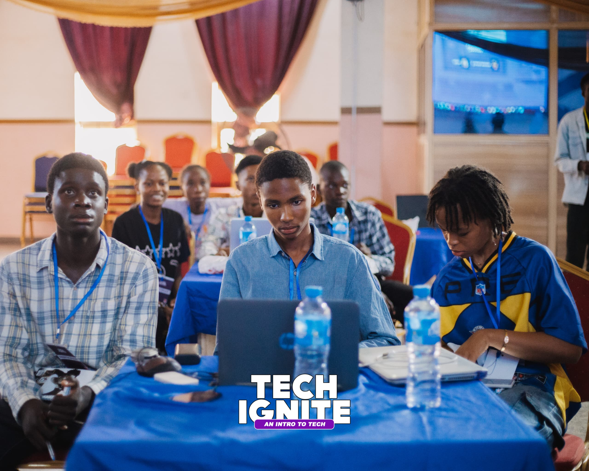
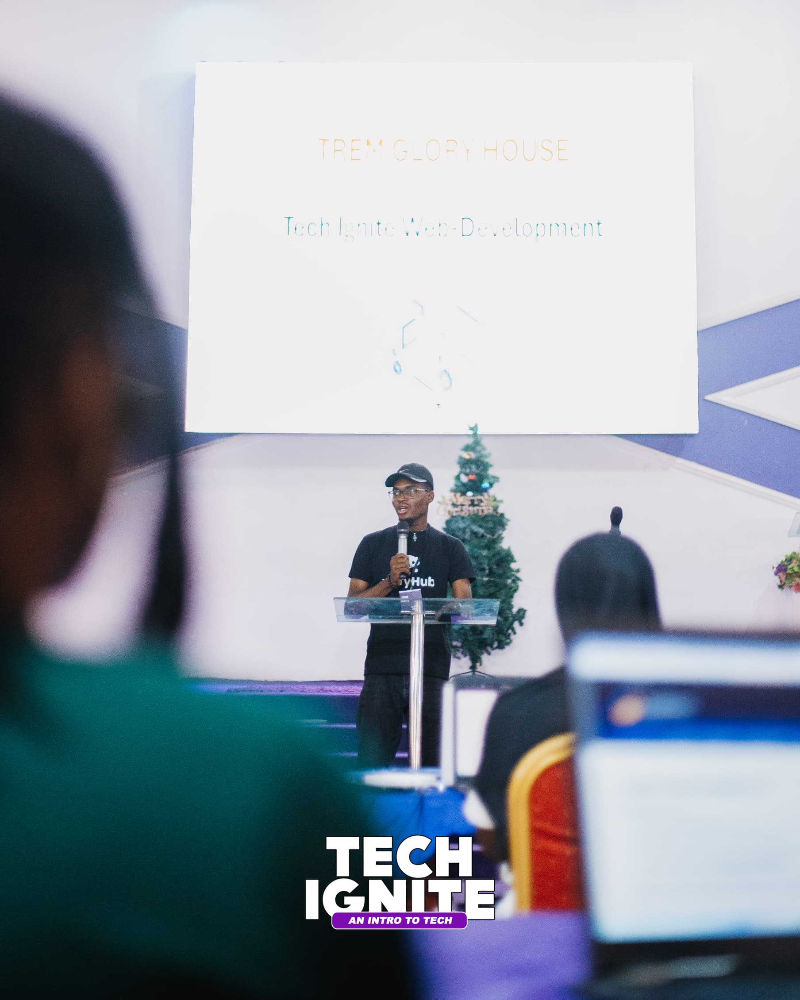
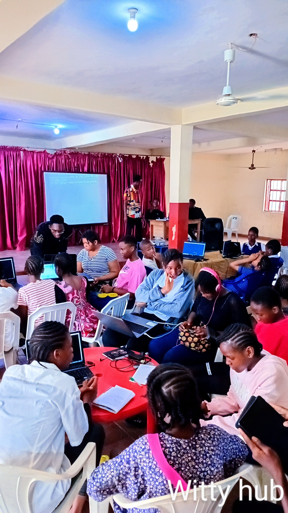
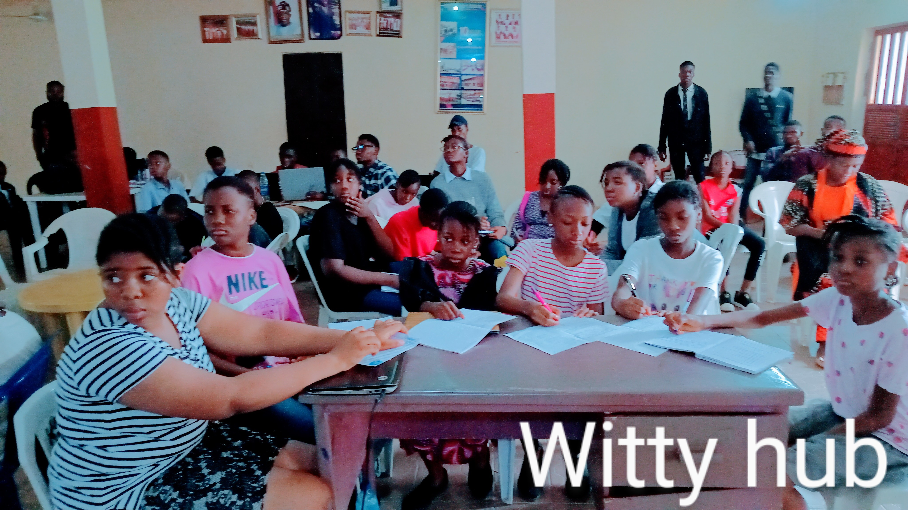

# 🚀 Teaching & Tech Events Portfolio

## David Amos

**Backend Developer** | **Technical Tutor** | **Tech Program Organizer**

---

## 📌 Overview

This repository documents my experience organizing and facilitating **hands-on tech trainings**, **bootcamps**, and **structured learning programs**.

My focus is on **practical backend development**, **problem-solving**, and **real-world project delivery**, while **mentoring learners toward industry readiness**.

I have over **4+ years of experience tutoring**, alongside **building and deploying production-level systems** through my **tech startup**.

---

## 🎯 Programs & Events

---

### 🚀 Tech Ignite Program

**Role:** Organizer & Lead Tutor  
**Format:** Intensive hands-on training  
**Audience:** Beginners to Intermediate learners

#### Topics Covered
- **Backend Development with Python**
- **APIs & Server-side Architecture**
- **Firebase** (Authentication, Database)
- **Git & Version Control**
- **Introduction to Robotics & Embedded Systems**
- **Other Tech Skills:** Videography, Graphics Design, Web Development

#### Highlights
- Designed curriculum and lesson flow  
- Led live sessions and practical labs  
- Mentored students through real-world projects  
- Tracked progress and provided technical feedback  

📸 *Event Photos*  
  

---

### 🧑‍💻 Tech Bootcamp

**Role:** Tutor & Technical Mentor  
**Duration:** Multi-week bootcamp  
**Focus:** Skill-building & Project-based learning

#### Core Areas
- **Python Backend Development**
- **Database Concepts & API Integration**
- **Authentication Systems**
- **Debugging & Backend Problem-solving**

#### Responsibilities
- Delivered structured lessons  
- Assisted learners with backend issues  
- Reviewed code and guided improvements  
- Supported learners with career and growth guidance  

📸 *Bootcamp Sessions*  

---

### 📘 Tech Training Workshops

**Role:** Organizer & Facilitator  
**Type:** Short-form technical workshops

#### Tools & Technologies
- **Python**
- **Firebase**
- **Git & GitHub**
- **Arduino & Robotics Basics**

#### Outcomes
- Simplified complex backend concepts  
- Encouraged hands-on experimentation  
- Introduced learners to real-world tech workflows  

📸 *Workshop Moments*  

---

## 🧠 Teaching Approach

- **Practical-first learning** (less theory, more building)
- Real-world examples from live projects
- Clear explanation of complex concepts
- Strong focus on problem-solving & debugging
- Mentorship beyond code (career & mindset)

---

## 🛠️ Tech Stack & Tools

- **Languages:** Python, C++, Dart  
- **Frameworks:** Flutter, React (TypeScript), FastAPI, Flask  
- **Backend:** APIs, Server-side Logic  
- **Database & Auth:** Firebase  
- **Dev Tools:** Git, GitHub, Vercel  
- **Hardware & Robotics:** Arduino, Embedded Systems, Raspberry Pi  
- **AI:** Model Development & Experimentation  

---

## 🔗 Links

- **GitHub:** https://github.com/Davitellox  
- **Projects Portfolio:** *(‎https://github.com/Davitellox/doxa)*, *(‎https://github.com/Davitellox/safehaven)*
- ‎**A demo video of my EdTech Robot (Prototype);** *(‎‎‎https://drive.google.com/file/d/1iX7Sdc7_OH0lFLxvYmLVKYNEk8kEBpQU/view?usp=sharing)*, *(‎‎https://drive.google.com/file/d/1Z_SOumSYlg9703Djyi6gOwztd9-bIB8K/view?usp=sharing)*
- **‎A folder of short clips of my hobbyist projects;** *(‎‎https://drive.google.com/drive/folders/1OhwcUKjVinFtz-2GxTY8PeOmhJaP-0sB?usp=sharing)*

---

## 📬 Contact

For collaboration, tutoring, or backend development opportunities:

📧 **Email:** davitelloamos@gmail.com
